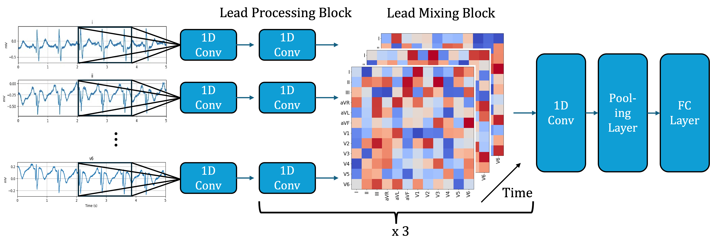

# Lightweight Attention-Based Myocardial Infarction Detection Methods
  Coronary Heart Disease (CHD) is responsible for approximately 9 million deaths per year. Myocardial Infarction (MI) is one of CHD's manifestations. In this paper, we propose to build a lightweight model with high MI detection accuracy. Our model is based on lead-wise 1D convolutions and utilizes the attention mechanism for inter-lead communication. This architecture design enables our model to consume almost 3 times less memory and is more than 54 times faster than a previous approach we compared it to. Our model outperforms the baseline in terms of precision and specificity and achieves a comparable accuracy of 89.31\% and an F1 score of 91.84\%. Furthermore, we demonstrate the robustness of our model to noise in the input data and hyperparameter changes. In addition, we demonstrate that our model even performs well using only leads I,II, and III. These findings indicate that lightweight models can successfully detect MIs with performance comparable to larger models. Overall, we see this as a step towards MI detection on low resource devices such as wearable and an alleviation of clinicians workloads through automatization.

*Figure 1: Visualization of our architecture used for MI detection.*

## Data

To run the experiments please download the data from [PTB - PhysioNet](https://www.physionet.org/content/ptbdb/1.0.0/) and place it in the `/ptbdb` folder. Depending on the specific location you might have to adjust paths in the `main.ipynb` notebook.

## Experiments
To run the experiments, open the `main.ipynb` notebook and run the cells in order. Consider adjusting paths for the dataset. Please consider using Google Colab since we ran our experiments only on Google Colab, so we can’t guarantee that the notebook will work on other platforms.

## Visualization

The notebook `visualization.ipynb` contains code for our visualizations. Please note that you might have to manually copy your results from the `logs` folder into the dictionaries or arrays.

## Random Seed
All our experiments have been conducted using the random seeds in the jupyter notebook. By default, we used the `seed=0`. If we trained several instances of the same model, we incremented the seed by one, `seed=1,2,3,...`.